Logo credit to my good friend, [Lochy.](https://www.linkedin.com/in/lochlyn-thomas-045b55289/)

### Front End: https://pokemondaycare.tech/

### Back End: https://api.pokemondaycare.tech/

### Front End Repository: https://github.com/zakaryjs/PokemonDayCare-Frontend

### Back End Repository: https://github.com/zakaryjs/PokemonDayCare-Server

Everyone knows the Pokemon daycare. Whether you were too lazy to farm exp, were trying to breed that perfect competitive mon, or just wanted to hatch a shiny - the daycare has always been there to help make that possible.

# General Documentation

## Pre-Created Users:

Seed the database using ```npm run seed```

Admin:
email: adminuser@mail.com
password: admin123

User:
email: jimmy@mail.com
password: jimmy123

## Project Management

** All tasks were allocated to me, as I completed this project solo. Though I consider myself to be stronger in the frontend rather than the backend, it was a good learning experience and a good way to push myself outside of the comfort zone.

Screenshots taken throughout the duration of Part B:

December 10


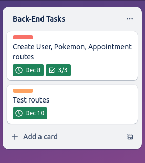

December 14


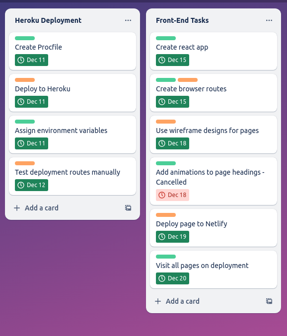

December 21


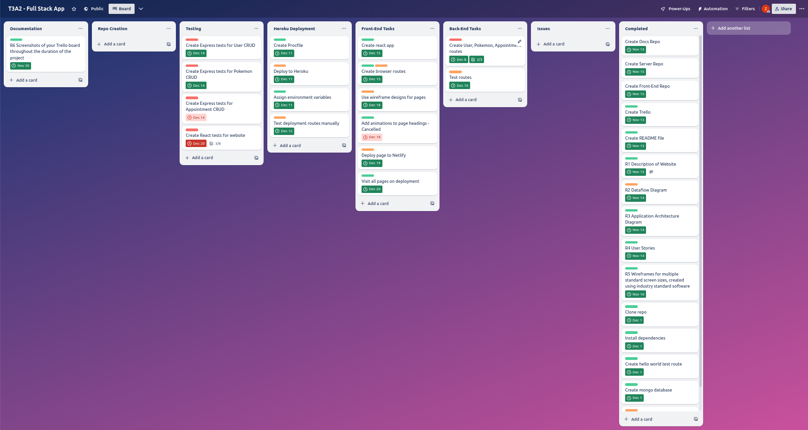

December 23


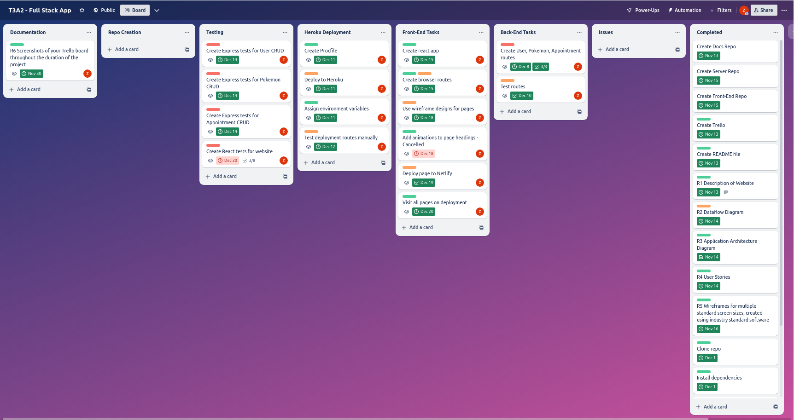

As per my plan in Part A, I began the second part of the project by working through the backend. The process was as follows:

- Create models

- Create basic functions

- Create routes with said functions

- Manually test these routes, with multiple different scenarios in order to fully test functionality and try and find edge cases

- If any bugs are found, pause development and work to fix them

- Deploy the server

I then began work on the front end:

- Create basic pages

- Create account portal

- Create functionality relating to account portal

- Make fetch requests to the server

At this point in the project, I had to figure out how to store and use the JWT. 

This was one of the major hurdles I had in the project, as I really struggled to figure out how to create and store cookies properly. After a few days of testing, they finally worked, however:

I read that 3rd party cookies where soon to be blocked by browsers, and, after testing on mobile devices I figured out that Safari blocks third party cookies anyway. 

The solution? A custom domain. The next few days were spent configuring Netlify, Heroku and domain DNS' in order to get this to work. I am really proud of this. 

The remainder of the project was spent:

- Finalising functionality (more pages, redirects, custom hooks)

- Adding styling

- Writing tests for both the front and back end. 

- Writing documentation

#### Front End Branches

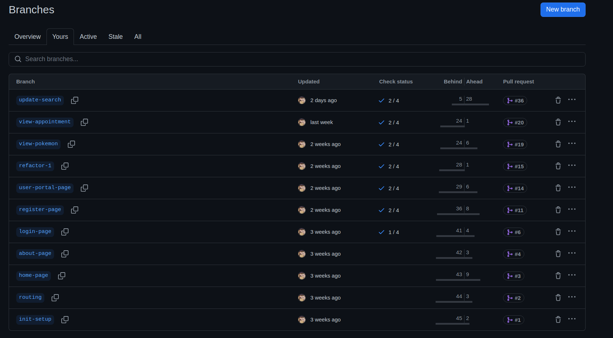

For the branches, I separated each major feature into its own branch. These were designed to be similar to the tasks that I had outlined in the Trello. The ```update-search``` branch was definitely the biggest - it was used to update page search functionality, as well as make many other small changes.

Smaller page specific branches were also deleted throughout the duration of the project.

#### Back End Branches

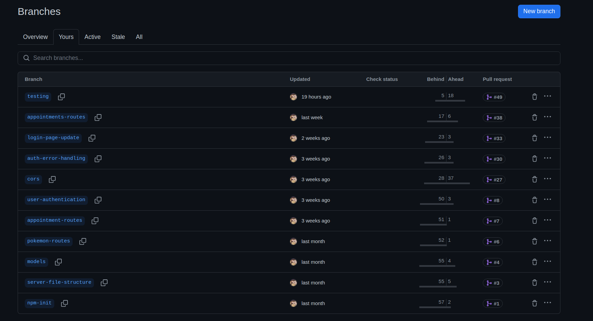

For the branches, I again separated each major feature into its own branch. These were again designed to be similar to the tasks that I had outlined in the Trello. These were more separated than the front end branches, as overall less time was spent on the backend. 

## Testing

Jest tests are available in both the front and back end repos. As I moved towards the end of the project, I decided to cut Cypress testing out of the plan as it was not something that I was familiar with, and I wanted to make sure that I completed the project on time.

I also completed manual project testing, by testing each page, as well as each user story.
Spreadsheet [here.](./docs/T3A2-B_Testing_Spreadsheets.xlsx)

## Cuts

- Cypress testing, as mentioned previously.

- Appointment edits - I realised that it didn't really make sense for users to be able to edit their appointments whenever they please. How would the day care owners prepare for a sudden change? If the user needs to change the date, they now need to delete and recreate the appointment, with the new date.

# Front End Documentation

## Libraries Used

### React
A JavaScript library created by Meta that is used for building component-based user interfaces. React is what this app was built with, though other packages were also used throughout development.

### React-Router-Dom
A React package that allows for seamless navigation throughout a single page application. In this app, it is used to control navigation through the navbar, in buttons, and through automatic redirects after certain actions are completed.

### CoreUI 
A package that contains a variety of pre configured components for use within a React application. In this app, it is used for the footer.

### Material UI / Emotion / Material UI X Date Pickers
A package that, like CoreUI contains a variety of pre configured components for use within a React application. In this app, it is used in conjunction with dayJS in order to provide the date pickers that are used in the create appointment page.

### DayJS
DayJS is a JavaScript library that is used to manage dates in JavaScript applications. It is capable of validating, displaying and manipulating dates in various formats. In this application, it is used as an adapter for the date provider that is used for the Material UI date pickers.

### Bootstrap / React Bootstrap
A package that, like CoreUI and Material UI contains a variety of pre configured components for use within a React application. In this application, it is used for the buttons that can be seen in various places throughout the application.

### React Icons
A package that provides hundreds of pre configured icons for use within a React Applications. It includes icons from places such as FontAwesome and Bootstrap. In this app, it is used for the trash icon that is used for deleting pokemon and appointments. 

### React Loader Spinners
A package that provides a variety of pre configured loader spinners. In this app, the grid and circle spinners are used in account and creation related pages. 

### Jest
Jest is a JavaScript testing framework that can be used for testing different parts of app functionality. Jest supports function and data mocking, as well as providing checks for code coverage. In this project, Jest is used with React Testing Library in order to test the application.

### React Testing Library
React Testing Library is a package that is used to test React components. It works in conjunction with Jest in order to provide a way to test a React App. In this app, it is used to test a variety of components.

## Screenshots

### Home
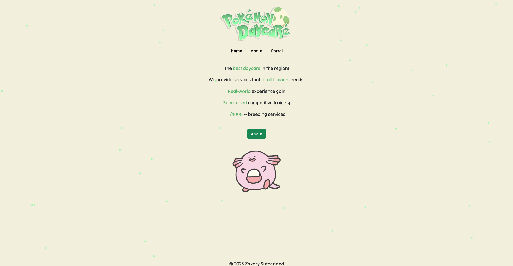

### About
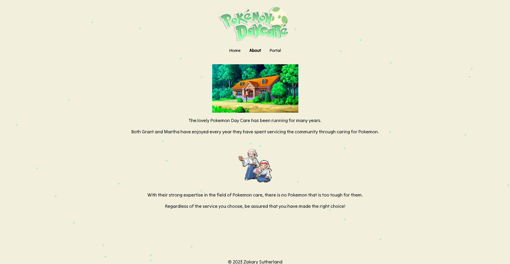

### Portal - User View
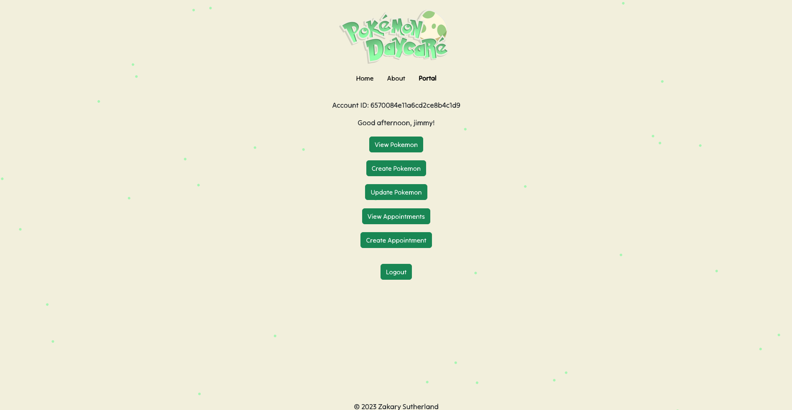

### Portal - Admin View
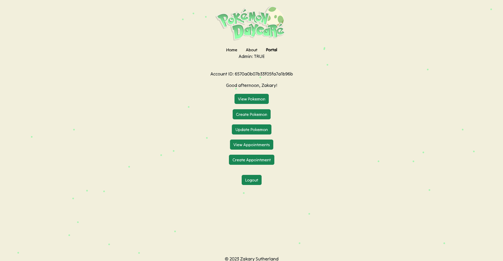

### Pokemon - User View
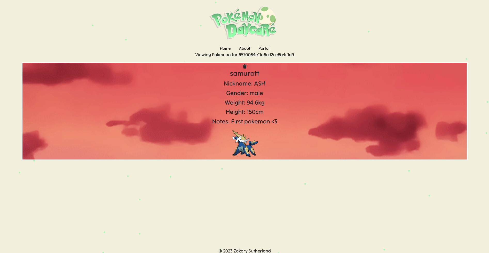

### Pokemon - Admin View
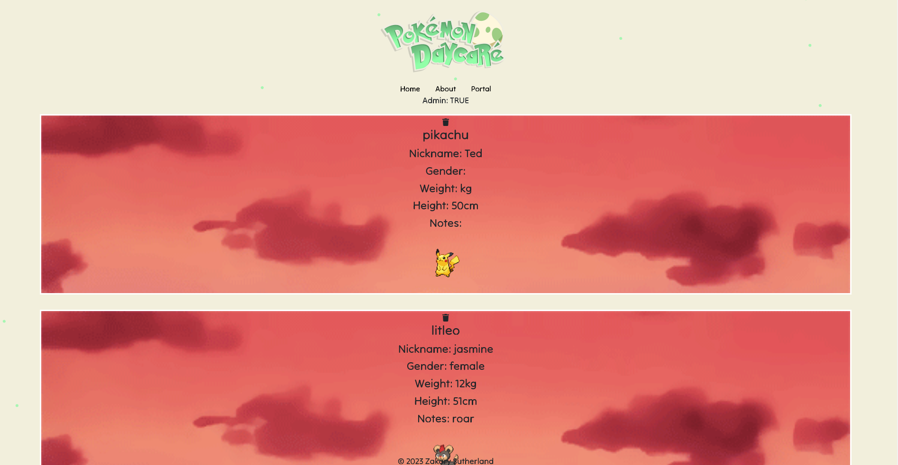

### Create Pokemon
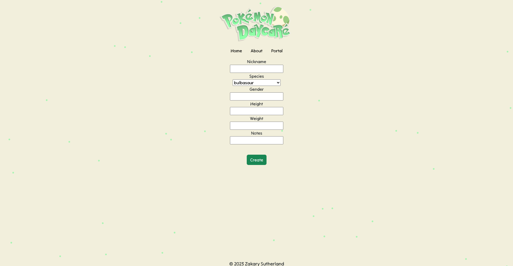

### Update Pokemon
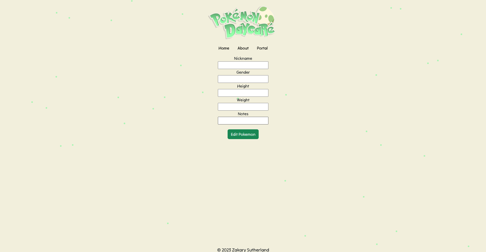

### Appointment - User View
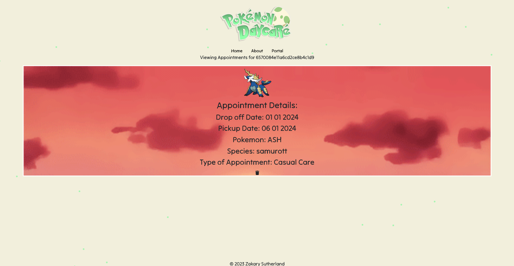

### Appointment - Admin View
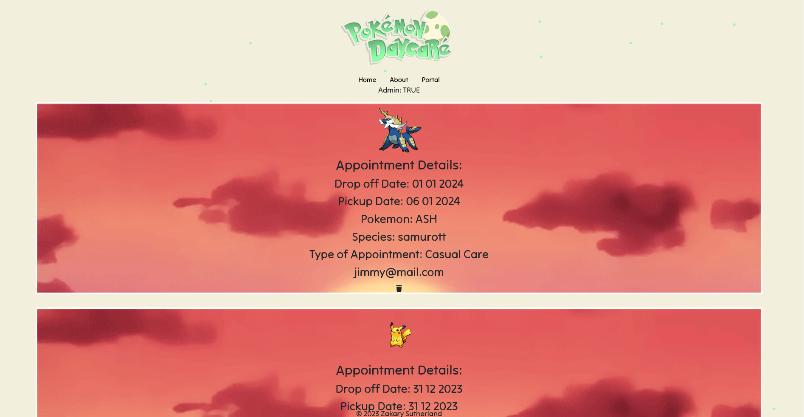

### Create Appointment
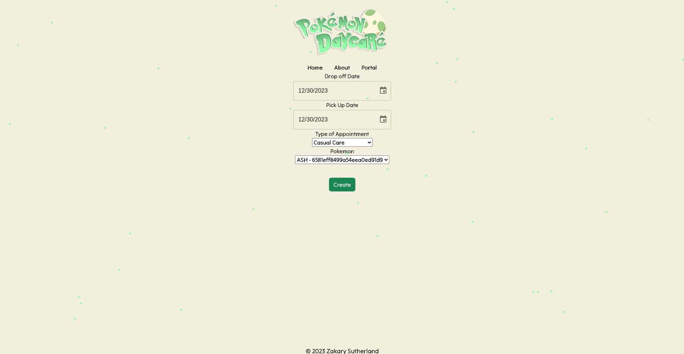

# Back End Documentation

## Server Routes

 - "/" 

 Response:

 ```
 { 200
    message: "Hello world! The server is working :)"
 }
 ```

 - "/invalid-route"

 Response:

 ```
 { 200
    message: "There are no routes with that path."
 }
 ```

 #### User Controller

 - "/register"
 POST

 Request:

 ```
 {
    firstName: String,
    lastName: String,
    password: String,
    email: String,
    isAdmin: String
 }
 ```

 Error:

 ```
 { 400
    error: error
 }
 ```

 Response:

 ```
 { 201
    user: newUser
 }
 ```

 - "/login"
 POST

 Request:

 ```
 {
    email: String,
    password: String
 }
 ```

 Error:

 ```
 { 400
    message: "Invalid user details provided."
 }
 ```

Response:

 ```
 { 200
    encryptedJWT
 }
 ```

 - "/logout"
 POST

 Response:

 ```
 { 200
    message: "logged out"
 }
 ```

 - "/token-refresh"
 POST

 Error:

 ```
 { 400
    error: "no user found"
 }
 ```

 Response:

 isAdmin = true:

 ```
 { 200
    jwt: refreshResult,
    isAdmin: true,
    user: parsedData
 }
 ```

 isAdmin = false:

 ```
 { 200
    jwt: refreshResult,
    user: parsedData
 }
 ```

 - "/:userID"
 GET

 Response:

 ```
 { 200
    user: user
 }
 ```


 #### Pokemon Controller

 - "/all"
 GET

 Error:

 ```
 { 400
    error: error
 }
 ```

 Response:

 ```
 { 200
    pokemon: allPokemon
 }
 ```

 - "/:userID"
 GET

 Error:

 ```
 { 400
    error: error
 }
 ```

 Response: 

 ```
 { 200
    pokemon: allPokemon
 }
 ```

 - "/find/:pokemonID"
 GET

 Error:

 ```
 { 400
    error: error
 }
 ```

 Response:

 ```
 { 200
    pokemon: pokemon
 }
 ```

 - "/"
 POST

 Request:

 ```
 {
    species: String,
    nickname: String,
    gender: String,
    height: Integer,
    weight: Integer,
    notes: String,
 }
 ```

 Error:

 ```
 { 400
    error: error
 }
 ```

 Response:

 ```
 { 200
    pokemon: NewPokemon
 }
 ```

 - "/:pokemonID"
 PUT

 Request:

 ```
 {
    nickname: String,
    gender: String,
    height: Integer,
    weight: Integer,
    notes: String,
 }
 ```

 Error:

 ```
 { 400
    error: error
 }
 ```

 Response:

 ```
 { 200
    pokemon: updatedPokemon
 }
 ```

 - "/:pokemonID"
 DELETE

 Error:

 ```
 { 400
    error: error
 }
 ```

 Response:

 ```
 { 200
    pokemon: deletedPokemon
 }
 ```

 #### Appointment Controller

 - "/all"
 GET

 Error:

 ```
 { 400
    error: error
 }
 ```

 Response:

 ```
 { 200
    appointment: allAppointments
 }
 ```

 - "/:userID"
 GET

 Error:

 ```
 { 400
    error: error
 }
 ```

 Response:

 ```
 { 200
    appointments: allAppointments
 }
 ```

 - "/find/:appointmentID"
 GET

 Error:

 ```
 { 400
    error: error
 }
 ```

 Response:

 ```
 { 200
    appointment: appointment
 }
 ```

 - "/"
 POST

 Request:

 ```
 {
    dropOffDate: String,
    pickUpDate: String,
    typeOfAppointment: String,
    pokemon: String,
    user: String
 }
 ```

 Error:

 ```
 { 400
    error: error
 }
 ```

 ```
 { 200
    appointment: NewAppointment
 }
 ```

 - "/:appointmentID"
 DELETE

 Error:

 ```
 { 400
    error: error
 }
 ```

 Response:

 ```
 { 200
    appointment: deletedAppointment
 }
 ```
 

 ## Libraries Used

 ### Bcrypt
Bcrypt is a hashing function that is used in order to encrypt sensitive information. This is done by hashing, and then salting the string in question. In this project, bcrypt is used to encrypt user passwords before being sent to be stored in the Mongo database.


 ### Cookie-Parser
 Cookie parser is a library that is used in order to parse the cookies sent in a request, which populates request.cookies. This makes it easier to access these values in order to properly process a server response. In this project, cookie-parser is used to access the 'jwt' and 'isAdmin' values in order to determine the result of a request.


 ### Cors
Cors is a library that is used in order to restrict which domains can make requests to the server. In this project, domains are restricted to the site itself, as well as localhost, for testing purposes. 


 ### Dotenv
Dotenv is a library that makes variables declared in the .env file accessible by the app. In this project, it is used to make secret variables used by the server, accessible by the server.


 ### Express
Express is a minimalist web framework that is built for use with NodeJS. It provides support for a wide range of features to be used in web applications. In this project, the server has been built with ExpressJS due to previous knowledge and for use with routing and middleware.


 ### Jest
Jest is a JavaScript testing framework that can be used for testing different parts of app functionality. Jest supports function and data mocking, as well as providing checks for code coverage. In this project, Jest is used with Supertest to test the API server routes.


 ### jsonwebtoken
A JSON web token is a JSON object that used in order to securely transfer pieces of data between two locations over the internet. In this project, JWTs are sent between the server and client in order to: verify the user is logged in, verify who the user is, and verify their admin status.


 ### Mongoose
Mongoose is an ODM library for Node, that is used for MongoDB. Mongoose allows for schemas to be created for use with Mongoose, which can then be used with functions and routes in order to allow for data sent to the server and database to be validated.


 ### Validator
Validator is a library that is used for string validation and sanitisation. The library comes with a variety of validators that can be used for different situations. In this project, validator is used in the User schema, in order to determine whether the provided email is a valid email or not.


 ### Nodemon
Nodemon is a library that is used to help develop Node apps. It does this by automatically restarting the app whenever it detects changes made to any project files. 


 ### Supertest
Supertest is a library that is used to test APIs. Supertest is a library that extends another library known as Superagent, another API testing library. Supertest works together with Jest, a testing framework, in order to test different API routes. 